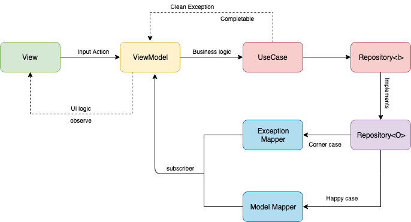
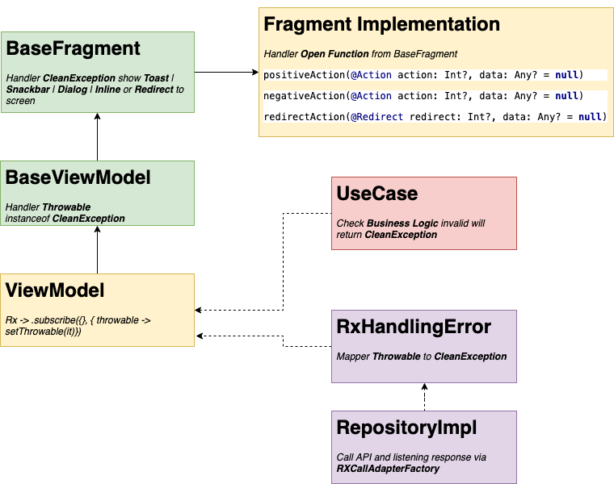

Clean Architecture
===========================================================

Introduction
-------------
This is a basic code that uses Clean Architecture & Components.
I have written about how to architect android application using the Uncle Bob's clean architecture approach.

### Mandatory Features
In General this application can run in online or offline mode
- Load user data from Github depend on query searching
- First call search will be call api (mode online) or room (mode offline) and not yet sorting
- After click `ASC` or `DESC` on radio button will be call api (mode online) or room (mode offline) and order by that
- When scrolling and the position in 10th product, it will be request to open second page from api, but not yet for offline mode
- When more than 3 page load, it will be show dialog popup, because it need login first
- We can set favorite user with click love icon
- When we will see list favorite, just click Floating Button with download icon
- We can remove favorite by click trash icon

### UI & Unit Test
We can easily running UI & Unit Test to coverage lines of code (LOC):
- `FindUserUseCaseTest` for testing Use Case `FindUserUseCase`
- `SearchUsersUseCaseTest` for testing Use Case `SearchUsersUseCase`
- `SearchUsersFavoriteUseCaseTest` for testing Use Case `GetAllUserFavoriteUseCase`
- `UserRepositoryImplTest` for testing Repository Implement `UserRepositoryImpl`
- `UserMapperTest` for testing Mapper `UserMapper`
- `DbTest` for testing Room Database `AppDatabase`
- `UserDaoTest` for testing Dao `UserDao`
- `UserApiTest` for testing Api Service `UserApi`
- `UserViewModelTest` for testing ViewModel `UserViewModel`
- `UserBaseMapperTest` for testing Model Mapper `UserModelMapper`
- `CrashlyticsTreeTest` for testing Crashlytics

#### Domain Layer
- Business Model
- Exception
- Annotation
- Repository Interface
- Use Case for User and Favorite
- Unit Testing for User UseCase

#### Data Layer
- Base Entity and Mapper
- Implementation Repository
- Executor API data
- Storage data to local: Share preferences, database, external storage
- Mapper data model to domain model
- Contains data service, third party data service
- Unit Testing for Repository, Model, Local DB and API

#### Presentation Layer
- View (Activity/Fragment/Layout) Adapt data to view
- Validate/Submit data input from view via UseCase

#### buildSrc Layer
This is the place to host all Android SDK configurations, Gradle Plugins, Modules, Android Units, Built Types, Libraries and Versions

### Base Code
Base code designed one `Activity` and multiple `Fragment`, using `Navigation Component` to UI navigate
Use Dagger2 (version 2.23.2) for Dependencies Injection, You can easily switch to using `Koin` (I suggestion `Dagger` for big, super projects)
Base code
- Has created a flow that handles all of the corner cases, you can easily customize them via `CleanException`, it `extends Throwable`
- Added `Interceptor` easily handler and `implementations` for your project if needed
- Use `ktlint`, `kotlin-offical` for check code conventions, you can run `./gradlew ktlint`
- Use `jacoco` for full Unit and Instrument test
- Report bugs into `Crashlytics` via `Timber.e`

### Building
Work from Android Studio 3.2 and above

### Data-Flow

### Work-Flow

### Handler-Error-Flow

### Libraries used
--------------
* [Foundation][0] - Components for core system capabilities, Kotlin extensions and support for
  multidex and automated testing.
    * [AppCompat][1] - Degrade gracefully on older versions of Android.
    * [Android KTX][2] - Write more concise, idiomatic Kotlin code.
    * [Test][4] - An Android testing framework for unit and runtime UI tests.
* [Architecture][10] - A collection of libraries that help you design robust, testable, and
  maintainable apps. Start with classes for managing your UI component lifecycle and handling data
  persistence.
    * [Data Binding][11] - Declaratively bind observable data to UI elements.
    * [Lifecycles][12] - Create a UI that automatically responds to lifecycle events.
    * [LiveData][13] - Build data objects that notify views when the underlying database changes.
    * [Navigation][14] - Handle everything needed for in-app navigation.
    * [Room][16] - Access your app's SQLite database with in-app objects and compile-time checks.
    * [ViewModel][17] - Store UI-related data that isn't destroyed on app rotations. Easily schedule
      asynchronous tasks for optimal execution.
    * [WorkManager][18] - Manage your Android background jobs.
* [UI][30] - Details on why and how to use UI Components in your apps - together or separate
    * [Animations & Transitions][31] - Move widgets and transition between screens.
    * [Fragment][34] - A basic unit of composable UI.
    * [Layout][35] - Lay out widgets using different algorithms.
* Third party
    * [Glide][90] for image loading
    * [Kotlin Coroutines][91] for managing background threads with simplified code and reducing needs for callbacks
    * [ReactiveX][92] library for composing asynchronous and event-based programs by using observable sequences.
    * [Dagger2][93] for dependencies injection
    * [Retrofit][94] Type-safe HTTP client for Android
    * [EasyPermission][95]  is a wrapper library to simplify basic system permissions logic when targeting Android M or higher.

[0]: https://developer.android.com/jetpack/components
[1]: https://developer.android.com/topic/libraries/support-library/packages#v7-appcompat
[2]: https://developer.android.com/kotlin/ktx
[4]: https://developer.android.com/training/testing/
[10]: https://developer.android.com/jetpack/arch/
[11]: https://developer.android.com/topic/libraries/data-binding/
[12]: https://developer.android.com/topic/libraries/architecture/lifecycle
[13]: https://developer.android.com/topic/libraries/architecture/livedata
[14]: https://developer.android.com/topic/libraries/architecture/navigation/
[16]: https://developer.android.com/topic/libraries/architecture/room
[17]: https://developer.android.com/topic/libraries/architecture/viewmodel
[18]: https://developer.android.com/topic/libraries/architecture/workmanager
[30]: https://developer.android.com/guide/topics/ui
[31]: https://developer.android.com/training/animation/
[34]: https://developer.android.com/guide/components/fragments
[35]: https://developer.android.com/guide/topics/ui/declaring-layout
[90]: https://bumptech.github.io/glide/
[91]: https://kotlinlang.org/docs/reference/coroutines-overview.html
[92]: https://github.com/ReactiveX
[93]: https://github.com/google/dagger
[94]: https://github.com/square/retrofit
[95]: https://github.com/googlesamples/easypermissions

License
--------

Copyright 2022 The Android Open Source Project, Inc.

Licensed to the Apache Software Foundation (ASF) under one or more contributor
license agreements.  See the NOTICE file distributed with this work for
additional information regarding copyright ownership.  The ASF licenses this
file to you under the Apache License, Version 2.0 (the "License"); you may not
use this file except in compliance with the License.  You may obtain a copy of
the License at

http://www.apache.org/licenses/LICENSE-2.0

Unless required by applicable law or agreed to in writing, software
distributed under the License is distributed on an "AS IS" BASIS, WITHOUT
WARRANTIES OR CONDITIONS OF ANY KIND, either express or implied.  See the
License for the specific language governing permissions and limitations under
the License.
